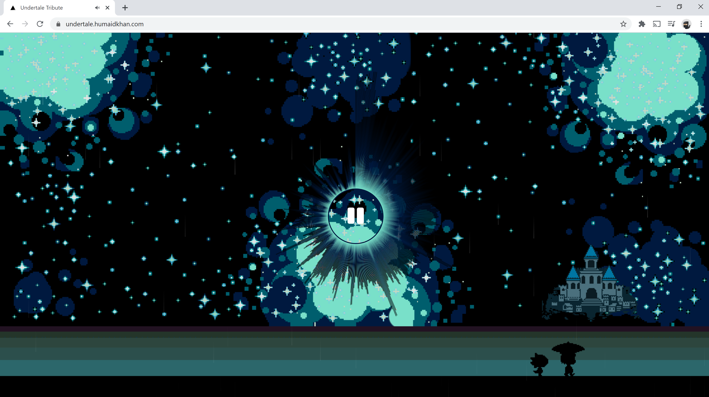

# Undertale Audio Visualizer

**_ This project is live _**

Project Link : [https://undertale.humaidkhan.com](https://undertale.humaidkhan.com)

Description:

This is a circular audio visualizer, built using HTML5 Canvas.

If you want to learn how I built it, I'll be doing a tutorial on my [blog](https://thecybermonkeys.com).

Note: I don't own the wallpaper or the music

The music is from [soundcloud](https://soundcloud.com/)
From [cementcity-1](https://soundcloud.com/cementcity-1/undertale-cement-city-remix)

The wallpaper is from [imgur](https://imgur.com/YP0IlgN)

The rain music is completely mine.

# Tech Stack

- Next
- React
- Canvas
- fontawesome

To run the app,

git clone https://github.com/humaidk2/undertale.git

cd undertale

npm install

npm run dev
